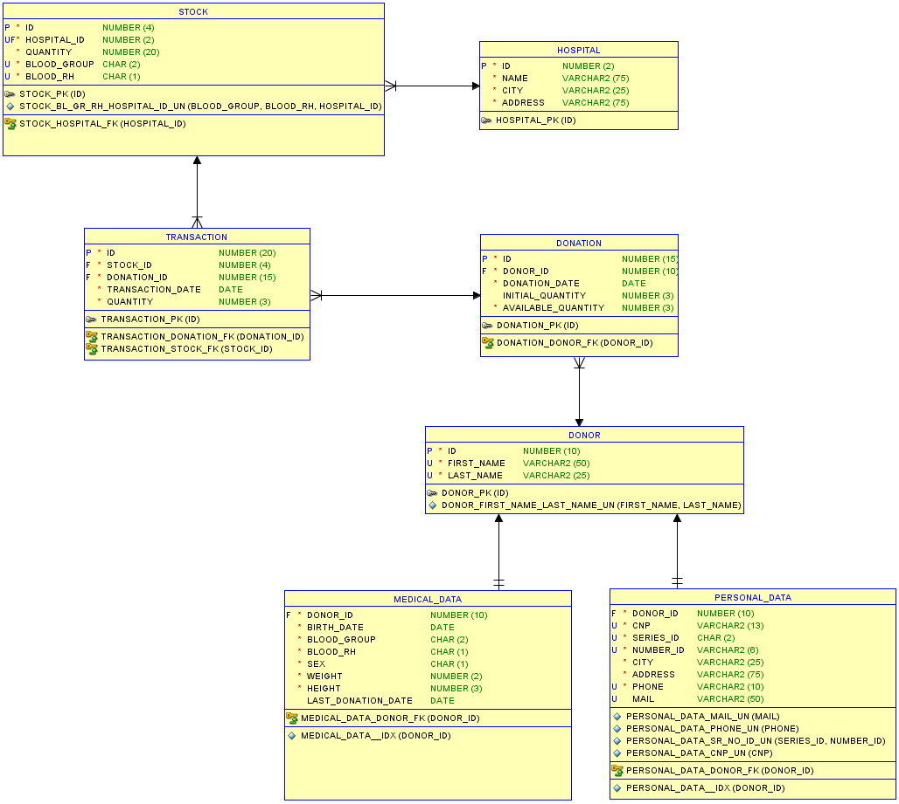

# Blood Bank Database

## Description
Database made in Oracle SQL Server (PLSQL) for a blood bank.

A donor must be aged between 18 and 60 yo to be eligible to donate blood. Another requirement is to pass at least 3 months since the last donation.

    

